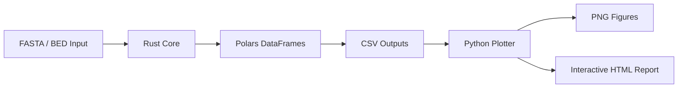

# 🦀 RustyOmeStats

### *Blazing-fast assembly statistics for genomes, metagenomes, transcriptomes, and beyond.*

<div align="center">


### ⚡ Modern Assembly Metrics • 📊 Interactive Reports • 🧬 Codon Analytics • 🚀 Parallelized Rust

</div>

---

# 🔬 What is RustyOmeStats?

**RustyOmeStats** is a high-performance bioinformatics toolkit written in **Rust** for calculating assembly statistics from:

* 🧬 Genomes
* 🌍 Metagenomes
* 🧫 MAGs
* 🧪 Transcriptomes
* 🧠 Metatranscriptomes
* 📖 Reference-guided assemblies

Designed for **speed**, **reproducibility**, and **publication-ready outputs**, RustyOmeStats combines modern Rust parallelism with rich plotting/report generation.

---

# ✨ Features

<table>
<tr>
<td width="50%">

## 🧬 Genome / Metagenome Analytics

* GC%
* Sequence length statistics
* N/L metrics (N25–N90)
* 6-frame codon density
* FragGeneScan predicted codon usage
* Parallel FASTA processing
* Folder-wide assembly analysis
* Polars-backed tabular outputs

</td>
<td width="50%">

## 📊 Modern Assembly Metrics

* N50 / L50
* NG50 / LG50
* U50 / UL50
* UG50 / ULG50
* Gap interval detection
* Overlap interval detection
* Coverage visualization
* Reference-aware assembly evaluation

</td>
</tr>
</table>

---

# 🖼️ Example Outputs

<div align="center">

| GC vs Length         | Codon Heatmap  | Coverage            |
| -------------------- | -------------- | ------------------- |
| 📈 Publication-ready | 🔥 Frame-aware | 🧬 Reference-guided |

</div>

```text
✔ Interactive HTML reports
✔ Self-contained PNG figures
✔ Polars DataFrames
✔ Parallelized Rust backend
✔ Reproducible workflows
```

---

# ⚡ Why RustyOmeStats?

| Feature                      | RustyOmeStats |
| ---------------------------- | ------------- |
| 🚀 Multi-threaded Rust core  | ✅             |
| 🧬 Codon density analysis    | ✅             |
| 📊 Automated visualization   | ✅             |
| 🌍 Metagenome support        | ✅             |
| 🧠 U50/UG50 implementation   | ✅             |
| 🐍 Python plotting layer     | ✅             |
| 📁 Batch assembly processing | ✅             |
| ⚙️ Polars DataFrames         | ✅             |

---

# 🧱 Architecture



---

# 🦀 Tech Stack

| Component         | Technology           |
| ----------------- | -------------------- |
| Core engine       | Rust                 |
| Parallelism       | rayon                |
| DataFrames        | polars               |
| FASTA/BED parsing | rust-bio             |
| CLI               | clap                 |
| Error handling    | anyhow               |
| Plotting          | seaborn + matplotlib |
| ORF prediction    | FragGeneScanRs       |

---

# 🚀 Installation

## 1️⃣ Install Rust

```bash
curl --proto '=https' --tlsv1.2 -sSf https://sh.rustup.rs | sh
rustup default stable
```

---

## 2️⃣ Install RustyOmeStats

### From crates.io

```bash
cargo install rustyomestats
```

### From source

```bash
git clone https://github.com/raw937/rustyomestats
cd rustyomestats

cargo install --path .
```

---

## 3️⃣ Optional: FragGeneScanRs

Required only for predicted codon density.

```bash
cargo install fraggenescanrs
```

or

```bash
conda install -c bioconda fraggenescanrs
```

---

## 4️⃣ Install Plotting Dependencies

```bash
pip install polars seaborn matplotlib
```

---

# ⚡ Quick Start

## 🧬 Analyze a Genome

```bash
rustyomestats genome \
    -f my_genome.fna \
    -o out/ \
    -t 8
```

Generate plots + HTML report:

```bash
python scripts/plot_stats.py -d out/
```

---

# 📦 Output Files

RustyOmeStats generates rich tabular outputs, publication-ready figures, and a fully self-contained interactive HTML report.

```text
summary_stats.csv
├── Global assembly statistics
├── Total sequences / total bp
├── GC%
└── N25–N90 and L25–L90 assembly metrics

per_sequence.csv
├── Per-contig / per-sequence statistics
├── Sequence ID
├── Length distribution
└── GC composition for every record

length_intervals.csv
├── Length-bin frequency table
├── Histogram-ready interval counts
└── Used for contig size distribution plots

codon_absolute.csv
├── Raw 6-frame codon statistics
├── Codon counts and densities
├── Frame-specific measurements
└── Long-format analytics table

codon_absolute_aggregate.csv
├── Global codon usage profile
├── Aggregated across all sequences
└── 64-codon genome-wide abundance table

codon_predicted.csv
├── FragGeneScan-predicted ORF codons
├── Per-gene codon frequencies
└── Coding-region codon density statistics

codon_predicted_aggregate.csv
├── Aggregate predicted ORF codon usage
├── Genome-wide predicted CDS codon profile
└── Useful for translational bias analyses

codon_comparison.csv
├── Absolute vs predicted codon usage
├── Enrichment/depletion statistics
├── Translational bias comparisons
└── Predicted-over-absolute enrichment metrics

fgs_predicted.{ffn,faa,out,gff}
├── Raw FragGeneScanRs outputs
├── Predicted nucleotide ORFs (.ffn)
├── Predicted proteins (.faa)
├── Gene annotations (.gff)
└── Raw model output/log files

plot_length_histogram.png
├── Contig/scaffold size distribution
└── Publication-ready histogram visualization

plot_gc_distribution.png
├── GC variability across sequences
└── Detects compositional heterogeneity

plot_gc_vs_length.png
├── GC% versus sequence length
├── Detects assembly structure patterns
└── Useful for MAG/metagenome exploration

plot_codon_usage_bar.png
├── Genome-wide codon abundance plots
├── Absolute vs predicted codon usage
└── Translational preference visualization

plot_codon_heatmap_by_frame.png
├── 6-frame codon density heatmap
├── Frame-aware codon visualization
└── High-dimensional codon pattern analysis

plot_codon_enrichment.png
├── Codon enrichment/depletion analysis
├── Predicted vs absolute codon shifts
└── Translational bias visualization

report.html
├── Fully self-contained interactive report
├── All plots embedded inline
├── Metric summaries + tables
├── Portable single-file visualization dashboard
└── Shareable publication-ready report
```

---

# 🌍 Analyze Multiple Assemblies

```bash
rustyomestats genome \
    -f assemblies/ \
    -o out/ \
    -t 32
```

---

# 🧠 U50 / UG50 Assembly Metrics

RustyOmeStats implements the modern metrics proposed in:

> [Castro et al. 2017](https://journals.sagepub.com/doi/abs/10.1089/cmb.2017.0013). Castro CJ, Ng TFF. U50: A New Metric for Measuring Assembly Output Based on Non-Overlapping, Target-Specific Contigs. J Comput Biol. 2017 24(11):1071-1080.

Including:

* U50
* UL50
* UG50
* ULG50
* Gap-aware assembly evaluation
* Overlap-aware assembly evaluation

---

# 🔬 Example U50 Workflow

```bash
rustyomestats u50 \
    --reference ref.fa \
    --bed contigs.sorted.bed \
    --outdir out/
```

Generate figures:

```bash
python scripts/plot_stats.py -d out/
```

---

# 📊 Generated Visualizations

<div align="center">

| Plot                | Description                     |
| ------------------- | ------------------------------- |
| 📈 GC Distribution  | GC variability across sequences |
| 🔥 Codon Heatmap    | Frame-specific codon usage      |
| 📉 Length Histogram | Assembly contig distributions   |
| 🧬 Coverage Plot    | Reference coverage structure    |
| 📊 U50 Summary      | Modern assembly metric overview |

</div>

---

# 🐍 Interactive HTML Reports

RustyOmeStats automatically generates:

✅ Self-contained HTML reports
✅ Inline PNG visualizations
✅ Portable single-file reports
✅ Publication-ready figures

Open directly in your browser:

```bash
firefox report.html
```

---

# 📚 Library Usage

RustyOmeStats can also be embedded as a Rust crate.

```rust
use rustyomestats::{io_utils, stats, u50};
use std::path::Path;

// genome stats
let files  = io_utils::collect_fasta_files(Path::new("genome.fna"))?;
let recs   = io_utils::load_all_records(&files)?;
let basic  = stats::compute_basic(&recs);

println!("{} sequences", basic.num_seq);

// U50 stats
let res = u50::compute_u50(
    Path::new("ref.fa"),
    Path::new("contigs.bed"),
    Path::new("out")
)?;

println!("UG50 = {}", res.ug50);
```

---

# 🧪 Testing

```bash
cargo test
```

Covers:

* N50/U50 correctness
* Greedy masking
* BED deduplication
* Reverse complements
* 6-frame codon indexing
* Hand-validated toy assemblies

---

# 📄 License

**Creative Commons Attribution-NonCommercial (CC BY-NC 4.0)**

See the `LICENSE` file for details.

---

# 📖 Citation

If you use **RustyOmeStats** in published work, please cite:

```text
White III RA et al.
RustyOmeStats: High-performance genome and metagenome assembly statistics in Rust.
```

---

# 🤝 Contributing

We welcome:

* 🧬 New assembly metrics
* ⚡ Performance optimizations
* 📊 Visualization improvements
* 🐍 Python plotting extensions
* 🦀 Rust ecosystem integrations

Pull requests and issues are encouraged.

---

# 📞 Support

* 🐛 GitHub Issues:
  - **Issues:** [RustyOmeStats Issues](https://github.com/raw-lab/rustyomestats/issues)

* 📧 Contact:
  - **Email:** [Dr. Richard Allen White III](mailto:rwhit101@uncc.edu)
  - If you have any questions or feedback, please feel free to get in touch by email.  </br>

---

<div align="center">

# 🦀 RustyOmeStats

### *Fast. Parallel. Modern Bioinformatics .*

Built with ❤️ in Rust.

</div>
