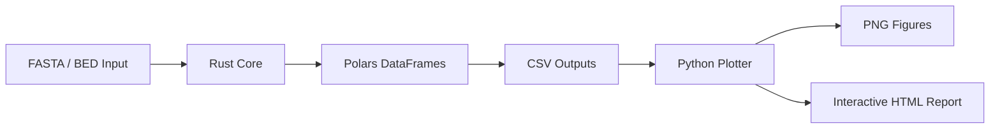

# 🦀 RustyOmeStats

### *Blazing-fast assembly statistics for genomes, metagenomes, transcriptomes, and beyond.*

<div align="center">


### ⚡ Modern Assembly Metrics • 📊 Interactive Reports • 🧬 Codon Analytics • 🚀 Parallelized Rust

</div>

---

# 🔬 What is RustyOmeStats?

**RustyOmeStats** is a high-performance bioinformatics toolkit written in **Rust** for calculating assembly statistics from:

* 🧬 Genomes
* 🌍 Metagenomes
* 🧫 MAGs
* 🧪 Transcriptomes
* 🧠 Metatranscriptomes
* 📖 Reference-guided assemblies

Designed for **speed**, **reproducibility**, and **publication-ready outputs**, RustyOmeStats combines modern Rust parallelism with rich plotting/report generation.

---

# ✨ Features

<table>
<tr>
<td width="50%">

## 🧬 Genome / Metagenome Analytics

* GC%
* Sequence length statistics
* N/L metrics (N25–N90)
* 6-frame codon density
* FragGeneScan predicted codon usage
* Parallel FASTA processing
* Folder-wide assembly analysis
* Polars-backed tabular outputs

</td>
<td width="50%">

## 📊 Modern Assembly Metrics

* N50 / L50
* NG50 / LG50
* U50 / UL50
* UG50 / ULG50
* Gap interval detection
* Overlap interval detection
* Coverage visualization
* Reference-aware assembly evaluation

</td>
</tr>
</table>

---

# 🖼️ Example Outputs

<div align="center">

| GC vs Length         | Codon Heatmap  | Coverage            |
| -------------------- | -------------- | ------------------- |
| 📈 Publication-ready | 🔥 Frame-aware | 🧬 Reference-guided |

</div>

```text
✔ Interactive HTML reports
✔ Self-contained PNG figures
✔ Polars DataFrames
✔ Parallelized Rust backend
✔ Reproducible workflows
```

---

# ⚡ Why RustyOmeStats?

| Feature                      | RustyOmeStats |
| ---------------------------- | ------------- |
| 🚀 Multi-threaded Rust core  | ✅             |
| 🧬 Codon density analysis    | ✅             |
| 📊 Automated visualization   | ✅             |
| 🌍 Metagenome support        | ✅             |
| 🧠 U50/UG50 implementation   | ✅             |
| 🐍 Python plotting layer     | ✅             |
| 📁 Batch assembly processing | ✅             |
| ⚙️ Polars DataFrames         | ✅             |

---

# 🧱 Architecture



---

# 🦀 Tech Stack

| Component         | Technology           |
| ----------------- | -------------------- |
| Core engine       | Rust                 |
| Parallelism       | rayon                |
| DataFrames        | polars               |
| FASTA/BED parsing | rust-bio             |
| CLI               | clap                 |
| Error handling    | anyhow               |
| Plotting          | seaborn + matplotlib |
| ORF prediction    | FragGeneScanRs       |

---

# 🚀 Installation

## 1️⃣ Install Rust

```bash
curl --proto '=https' --tlsv1.2 -sSf https://sh.rustup.rs | sh
rustup default stable
```

---

## 2️⃣ Install RustyOmeStats

### From crates.io

```bash
cargo install rustyomestats
```

### From source

```bash
git clone https://github.com/raw937/rustyomestats
cd rustyomestats

cargo install --path .
```

---

## 3️⃣ Optional: FragGeneScanRs

Required only for predicted codon density.

```bash
cargo install fraggenescanrs
```

or

```bash
conda install -c bioconda fraggenescanrs
```

---

## 4️⃣ Install Plotting Dependencies

```bash
pip install polars seaborn matplotlib
```

---

# ⚡ Quick Start

## 🧬 Analyze a Genome

```bash
rustyomestats genome \
    -f my_genome.fna \
    -o out/ \
    -t 8
```

Generate plots + HTML report:

```bash
python scripts/plot_stats.py -d out/
```

---

# 📦 Output Files

```text
summary_stats.csv
per_sequence.csv
codon_absolute.csv
codon_predicted.csv
codon_comparison.csv

plot_length_histogram.png
plot_gc_distribution.png
plot_gc_vs_length.png
plot_codon_usage_bar.png
plot_codon_heatmap_by_frame.png

report.html
```

---

# 🌍 Analyze Multiple Assemblies

```bash
rustyomestats genome \
    -f assemblies/ \
    -o out/ \
    -t 32
```

---

# 🧠 U50 / UG50 Assembly Metrics

RustyOmeStats implements the modern metrics proposed in:

> Castro et al. 2017

Including:

* U50
* UL50
* UG50
* ULG50
* Gap-aware assembly evaluation
* Overlap-aware assembly evaluation

---

# 🔬 Example U50 Workflow

```bash
rustyomestats u50 \
    --reference ref.fa \
    --bed contigs.sorted.bed \
    --outdir out/
```

Generate figures:

```bash
python scripts/plot_stats.py -d out/
```

---

# 📊 Generated Visualizations

<div align="center">

| Plot                | Description                     |
| ------------------- | ------------------------------- |
| 📈 GC Distribution  | GC variability across sequences |
| 🔥 Codon Heatmap    | Frame-specific codon usage      |
| 📉 Length Histogram | Assembly contig distributions   |
| 🧬 Coverage Plot    | Reference coverage structure    |
| 📊 U50 Summary      | Modern assembly metric overview |

</div>

---

# 🐍 Interactive HTML Reports

RustyOmeStats automatically generates:

✅ Self-contained HTML reports
✅ Inline PNG visualizations
✅ Portable single-file reports
✅ Publication-ready figures

Open directly in your browser:

```bash
firefox report.html
```

---

# 📚 Library Usage

RustyOmeStats can also be embedded as a Rust crate.

```rust
use rustyomestats::{io_utils, stats, u50};
use std::path::Path;

// genome stats
let files  = io_utils::collect_fasta_files(Path::new("genome.fna"))?;
let recs   = io_utils::load_all_records(&files)?;
let basic  = stats::compute_basic(&recs);

println!("{} sequences", basic.num_seq);

// U50 stats
let res = u50::compute_u50(
    Path::new("ref.fa"),
    Path::new("contigs.bed"),
    Path::new("out")
)?;

println!("UG50 = {}", res.ug50);
```

---

# 🧪 Testing

```bash
cargo test
```

Covers:

* N50/U50 correctness
* Greedy masking
* BED deduplication
* Reverse complements
* 6-frame codon indexing
* Hand-validated toy assemblies

---

# 📄 License

**Creative Commons Attribution-NonCommercial (CC BY-NC 4.0)**

See the `LICENSE` file for details.

---

# 📖 Citation

If you use **RustyOmeStats** in published work, please cite:

```text
White III RA et al.
RustyOmeStats: High-performance genome and metagenome assembly statistics in Rust.
```

---

# 🤝 Contributing

We welcome:

* 🧬 New assembly metrics
* ⚡ Performance optimizations
* 📊 Visualization improvements
* 🐍 Python plotting extensions
* 🦀 Rust ecosystem integrations

Pull requests and issues are encouraged.

---

# 📞 Support

* 🐛 GitHub Issues:
  [RustyOmeStats Issues](https://github.com/raw937/rustyomestats/issues?utm_source=chatgpt.com)

* 📧 Contact:

---

<div align="center">

# 🦀 RustyOmeStats

### *Fast. Parallel. Modern Bioinformatics.*

Built with ❤️ in Rust.

</div>


# Rustyomestats - calculating denovo assembly statistics for genomes, metagenomes etc.

Fast genome statistics in Rust. 

Two subcommands:
* **`genomes or metagenomes`** — from a FASTA (single genomes, transcriptomes, metagenomes, metatranscriptomes or folder of assemblies): length,
  GC, N/L stats, 6-frame codon density, and FragGeneScan-predicted codon
  density. All tabular output is written as polars DataFrames.
* **`U50`** — Modern assembly metrics from a reference FASTA +
  sorted BED of mapped contigs: **N50, L50, NG50, LG50, U50, UL50, UG50,
  ULG50, UG50%**, plus gap and overlap intervals.

Plots (seaborn) are rendered by a small Python driver that reads the CSV files
with polars and can emit both PNGs and a self-contained HTML report.

## Stack

* **Rust** — `bio`, `polars`, `rayon`, `clap`, `anyhow`.
* **Python plotter** — `polars`, `seaborn`, `matplotlib`.

## Install

### 1. Rust toolchain

Current Rust is needed (≥ 1.85 for `polars 0.46`). Install with rustup:

```bash
curl --proto '=https' --tlsv1.2 -sSf https://sh.rustup.rs | sh
rustup default stable
```

### 2. Build and install `rustyomestats`

Once it's published on crates.io you can install from there:

```bash
cargo install rustyomestats
# binary lands in ~/.cargo/bin/rustyomestats
```

Or build from source:

```bash
git clone https://github.com/raw937/rustyomestats
cd rustyomestats
cargo install --path .
# or just: cargo build --release && ./target/release/rustyomestats --help
```

### 3. FragGeneScanRs (only needed for predicted codon density)

```bash
cargo install fraggenescanrs
# or
conda install -c bioconda fraggenescanrs
```

If you run `genome --skip-predicted` you can skip this entirely.

### 4. Python plotter

```bash
pip install polars seaborn matplotlib
```

---

## Quick start: a single genome

Everything for one FASTA — length/GC/N-L + 6-frame absolute + FGS-predicted
codon density, then plots:

```bash
rustyomestats genome -f my_genome.fna -o out/ -t 8
python scripts/plot_stats.py -d out/
```

Outputs under `out/`:

```
summary_stats.csv                      # num_seq, total_bp, GC%, N25..N90, L25..L90
per_sequence.csv                       # id, length, GC per record
length_intervals.csv                   # binned length histogram
codon_absolute.csv                     # long-form: id × frame × codon × count/density
codon_absolute_aggregate.csv           # 64-codon totals pooled over all records/frames
codon_predicted.csv                    # per-ORF codon counts from FGS
codon_predicted_aggregate.csv          # 64-codon totals for predicted ORFs
codon_comparison.csv                   # abs vs predicted + enrichment_pred_over_abs
fgs_predicted.{ffn,faa,out,gff}        # raw FragGeneScanRs outputs
plot_length_histogram.png              # } seaborn plots (after running plot_stats.py)
plot_gc_distribution.png               # }
plot_gc_vs_length.png                  # }
plot_codon_usage_bar.png               # }
plot_codon_heatmap_by_frame.png        # }
plot_codon_enrichment.png              # }
report.html                            # self-contained HTML with every plot inline
```

### Variations

```bash
# folder of assemblies / MAGs
rustyomestats genome -f assemblies/ -o out/ -t 8

# skip FragGeneScan (no FGS install needed)
rustyomestats genome -f my_genome.fna --skip-predicted

# short reads instead of an assembled genome
rustyomestats genome -f reads.fa --fgs-model illumina_10

# change the length-histogram bin size
rustyomestats genome -f my_genome.fna --interval 500
```

### `genome` flags

| flag | default | notes |
|---|---|---|
| `-f, --fasta` | *required* | file or directory |
| `-i, --interval` | `1000` | length histogram bin (bp) |
| `-o, --outdir` | `rustyomestats_out` | output directory |
| `-t, --threads` | `0` | `0` = all available (rayon) |
| `--skip-absolute` | off | skip 6-frame codon density |
| `--skip-predicted` | off | skip FGS codon density |
| `--fgs-bin` | `FragGeneScanRs` | binary path or name |
| `--fgs-model` | `complete` | FGS training model |

---

## `U50` subcommand — Modern assembly metrics (Castro et al. 2017)

### Definitions

Let the contigs mapped to the reference, sorted longest → shortest by their
**original** length (from the BED), be `c₁, c₂, …, cₙ`. Greedy masking: each
contig claims its reference positions, but positions already claimed by an
earlier (longer) contig are removed. The surviving per-contig lengths are the
**unique-bp** lengths `c′₁, c′₂, …, c′ₙ` (contigs reduced to zero unique bp
drop out).

* **N50** — the length of the shortest contig such that 50 % of the sum of
  all contig lengths is contained in contigs of size N50 or larger.
* **L50** — the number of contigs whose cumulative length first reaches N50.
* **NG50 / LG50** — same as N50 / L50 but with the cutoff set to 50 % of
  the reference genome length (instead of 50 % of total contig length).
* **U50 / UL50** — the N50 / L50 definitions applied to the unique-bp
  lengths `c′ₖ` (cutoff at 50 % of total unique-bp length).
* **UG50 / ULG50** — same as U50 / UL50 but with the cutoff at 50 % of the
  reference genome length.
* **UG50%** — `100 × UG50 / reference_length`, i.e. what fraction of the
  reference the UG50 contig covers.

### Inputs

1. **Reference FASTA.** Single record (the first record is used as baseline;
   viral/bacterial references typical, matches the original Castro script).
2. **Sorted BED** of mapped contigs. Standard UCSC BED: 0-based, half-open
   (`chromEnd` exclusive). Only columns 1-3 are consumed. Lines starting with
   `#`, `track`, or `browser` are ignored.

A typical way to produce the BED from contigs aligned to the reference:

```bash
# contigs.bam is contigs aligned to ref.fa (e.g. via minimap2)
samtools sort contigs.bam -o contigs.sorted.bam
bedtools bamtobed -i contigs.sorted.bam | sort -k1,1 -k2,2n > contigs.sorted.bed
```

### Run

```bash
rustyomestats u50 \
    --reference ref.fa \
    --bed contigs.sorted.bed \
    --outdir out/

python scripts/plot_stats.py -d out/
```

### Output

```
u50_summary.csv                 # every metric in long form
u50_contigs.csv                 # start, stop, orig_length, unique_bp (desc)
u50_gap_intervals.csv           # uncovered stretches [start, end)
u50_overlap_intervals.csv       # stretches covered by ≥ 2 contigs + max_depth
plot_u50_summary.png            # N50/NG50/U50/UG50 bars with UG50% in the title
plot_u50_contig_lengths.png     # original vs unique-bp length distributions
plot_u50_coverage.png           # binned coverage track across the reference
report.html                     # self-contained HTML with every plot inline
```

### Minimal hand-verifiable example

Five contigs mapped to a 1000-bp reference:

```
ref.fa:  a single 1000-bp record
bed contents (0-based half-open):
  ref   0   400     # c1 (longest)
  ref 300   600     # c2 (overlaps c1 at 300-400)
  ref 550   800     # c3 (overlaps c2 at 550-600)
  ref 100   250     # c4 (fully inside c1)
  ref 900   950     # c5 (no overlap)
```

Expected numbers (hand-derivable):

```
total_original_length = 1150
total_unique_length   =  850
gap_bp                =  150   (ranges 800-900 and 950-1000)
overlap_bp            =  300   (100-250, 300-400, 550-600)
N50   = 300   L50   = 2
NG50  = 300   LG50  = 2
U50   = 200   UL50  = 2
UG50  = 200   ULG50 = 2
UG50% = 20.00 %
```

These values are covered by unit tests in `src/u50.rs`.

### `U50` flags

| flag | default | notes |
|---|---|---|
| `-r, --reference` | *required* | reference FASTA (first record only) |
| `-b, --bed` | *required* | sorted BED of mapped contigs |
| `-o, --outdir` | `rustyomestats_out` | output directory |

---

## Plotting

Both subcommands write CSVs. The bundled Python script reads those CSVs
(via polars) and renders seaborn figures as PNGs, plus a single self-contained
HTML report (`report.html`) with every PNG embedded as base64.

### Install the plotter's deps (once)

```bash
pip install polars seaborn matplotlib
# or, if you prefer a venv:
python3 -m venv .venv && source .venv/bin/activate
pip install polars seaborn matplotlib
```

### Run it

```bash
python scripts/plot_stats.py -d out/
```

Output (every entry is written only when the matching CSV is present — e.g.
U50 plots won't appear if you only ran `genome`):

```
out/
├── plot_length_histogram.png         # from genome
├── plot_gc_distribution.png          # from genome
├── plot_gc_vs_length.png             # from genome
├── plot_codon_usage_bar.png          # from genome (absolute ± predicted)
├── plot_codon_heatmap_by_frame.png   # from genome
├── plot_codon_enrichment.png         # from genome (needs both abs + predicted)
├── plot_u50_contig_lengths.png       # from u50
├── plot_u50_summary.png              # from u50
├── plot_u50_coverage.png             # from u50
└── report.html                       # all the above + metric tables, single file
```

Open `report.html` in any browser — it's self-contained, so you can share it
as a single attachment with no other files.

### Flags

| flag | default | notes |
|---|---|---|
| `-d, --dir` | `rustyomestats_out` | directory containing the rustyomestats CSVs |
| `--no-html` | off | skip `report.html`; PNGs still written |

Plots and the HTML report can be regenerated at any time from the CSVs —
no need to rerun the Rust pipeline.

---

## Library usage

`src/lib.rs` exposes `stats`, `codon`, `fgs`, `io_utils`, and `u50`, so the
same logic can be embedded in other Rust tools:

```rust
use rustyomestats::{io_utils, stats, u50};
use std::path::Path;

// genome stats
let files  = io_utils::collect_fasta_files(Path::new("genome.fna"))?;
let recs   = io_utils::load_all_records(&files)?;
let basic  = stats::compute_basic(&recs);
println!("{} sequences, {} bp", basic.num_seq, basic.total_bp);

// U50 stats
let res = u50::compute_u50(Path::new("ref.fa"), Path::new("contigs.bed"), Path::new("out"))?;
println!("UG50 = {} ({:.2} %)", res.ug50, res.ug50_pct);
```

## Tests

```bash
cargo test
```
Covers the N50 definition, greedy masking, hand-checked U50 toy case, BED
deduplication, reverse-complement, 6-frame codon indexing, and more.

## 📄 License

Creative Commons Attribution-NonCommercial (CC BY-NC 4.0) — See LICENSE file

## Citations 

If you are publishing results obtained using RustyOmeStats, please cite:


## Contributing to Rustyomestats

We welcome contributions of other experts expanding features in Rustyomestat. Please contact us via support. 

---

## 📞 Support 

- **Issues:** [open an issue](https://github.com/raw-lab/rustyomestats/issues). </br>
- **Email:** [Dr. Richard Allen White III](mailto:rwhit101@uncc.edu)
- If you have any questions or feedback, please feel free to get in touch by email.  </br>
---

